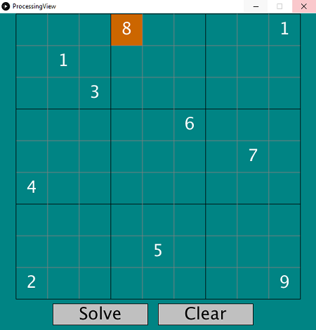
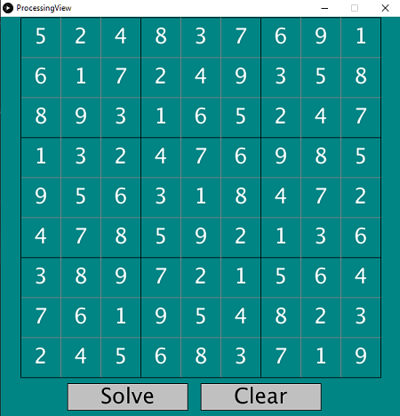

# Sudoku Solver

A simple Sudoku game solver.
So far the only solving algorithm is backtracking.

Libraries used:

- Processing - for creating the view. You can check out Processing [here](https://processing.org/).
    It's pretty cool :)
- JUnit for testing

A simple board will be displayed and you can select the position and assign the values from 1 to 9
or 0 for empty.

After you are done select 'Solve' to view the solution.

